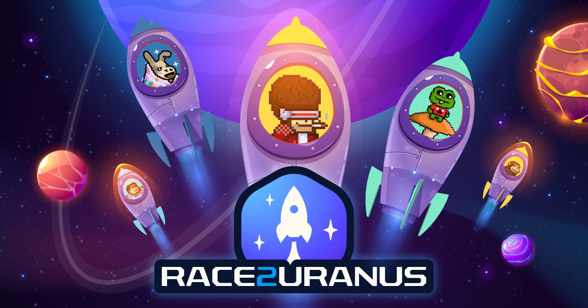

# Race2Uranus

Race2Uranus is a blockchain racing game set in the [Treasure](https://treasure.lol/) metaverse.

Treasure NFT holders can become brave rocketeers known as _Asstronauts_ and join the epic race to Uranus for a chance to earn epic glory and unimaginable riches!

Meanwhile, fans known as _Believers_ can stake their [$MAGIC](https://coinmarketcap.com/currencies/magic-token/) to support their idols and partake in their bounty!

## Motivation

We are huge fans of the Treasure ecosystem and we wanted to contribute to it in some way. We're also avid gamers and builders so creating our own game was the perfect choice.

We set out to make the game, but then we saw the community asking for more tooling and examples of dapps that they could reuse and build on top of. This really resonated with is because we've also been stuck and discouraged many times due to lack of proper documentation or samples that would help us get started.

That's why we eventually decided that we're going to open source our entire game in the hopes that it will help the next generation of builders create more awesome projects!

In this repository you can find a complete functional game with many standard problems that you would encounter when making your own dapp already solved for you. Be sure to also go through this entire readme as it contains documentation of some of the more interesting issues we faced and explanations of how we overcame them.

## Repository outline

This repository contains the full source code of the game. It's split into 3 parts:

- [UI](https://github.com/a55tronaut/race2uranus/tree/main/ui)
- [Smart Contracts](https://github.com/a55tronaut/race2uranus/tree/main/contracts)
- [API](https://github.com/a55tronaut/race2uranus/tree/main/api)

Specific documentation can be found in each of those directories.

## Lessons learned while developing Race2Uranus

While making this game, we ran into many interesting issues and we want to share our solutions with the community so you can focus on building your project instead of reinventing the wheel!

#### On-chain randomness

To make the game fair, we had to make its outcome unpredictable, i.e. based on a random value. But blockchain is deterministic in nature, so how can we get random values?

One way would be to use purpose-built services like [Chainlink VRF](https://docs.chain.link/docs/vrf/v2/introduction/). It's available on [Arbitrum](https://docs.chain.link/docs/data-feeds/price-feeds/addresses/?network=arbitrum#Arbitrum%20Mainnet) so in theory we could use it. However, there are some issues with approach:

- it's a paid service which adds cost and requires maintenance to make sure the account is funded
- it's an external dependency that we'd have to integrate with, which increases complexity and makes testing harder
- it uses a [request-response](https://docs.chain.link/docs/vrf/v2/subscription/examples/get-a-random-number/#request-random-values) model which makes the architecture more complicated, as opposed to just getting the randomness in the same transaction when we need it

So what else can we do? During our research, we found [this excellent article](https://blog.positive.com/predicting-random-numbers-in-ethereum-smart-contracts-e5358c6b8620) by Arseniy Reutov which suggested to use blockhashes for randomness. How can that be random though? Isn't blockhash the very definition of determinism? Turns out, there is a way: we use the blockhash of a **future** block, meaning we don't know it right now and it's very, very hard to figure out what it will be in advance, so for our purposes we can treat it as a good random value.

The way we use it in our game is the following:

- when the race starts, the smart contract commits to some future block number `n` that will be used as the source of randomness
- when block `n` is mined, we execute another transaction to calculate the outcome based on the previously unknown blockhash

We are aware that this is not perfect and one could potentially try to beat this system by trying to e.g. precalculate the blockhash in the preceding block and based on that decide whether to join the race or not, but it is still hard to pull off (requires a lot of computing power and a lot of funds in case of PoS). It can also be mitigated to some degree by e.g. commiting to future block `n` but only allowing to join the race up to block `n-10` to make it much harder to predict blockhash of `n` at a useful time. So we agreed that for our game this is good enough.

Final thing to note here is that smart contracts can only retrieve blockhashes of the 256 most recent blocks. Older blockhashes will be seen as just `0`s. This means that there is a time window in which the blockhash has to be used, otherwise its value will be lost to the smart contract.

#### Arbitrum block numbering

Arbitrum is a layer 2 blockchain and its block numbering is a bit unusual compared to layer 1s and can be a source of pitfalls. Since, as described above, we are relying on block numbers in our game, we had to explore this topic.

Arbitrum keeps track of both its own (L2) block numbers and L1 block numbers. When you access the `block.number` state variable inside a smart contract, you will actually get the number of the L1 block, not the Arbitrum block. Similarly, calling `block.blockhash(n)` gives you the blockhash of the L1 block. To access the L2 block numbers, you need to use the built-in [ArbSys](https://github.com/OffchainLabs/arbitrum/blob/master/docs/sol_contract_docs/md_docs/arb-os/arbos/builtin/ArbSys.md) contract. This is a precompiled system contract that exists in every Arbitrum chain, and conversely, does not exist outside of them.

This is a bit problematic in local test environments, since we'd have to deploy our own version of this contract just to be able to test our integration.

After giving it some thought, we decided to just use `block.number` because it gives us block numbers just fine and it's more portable (`block.number` is available in any EVM compatible environment).

A positive side effect of `block.number` giving us L1 blocks means that the 256 blocks limit mentioned in the section above translates to a bigger time window - 256 15-second blocks is much longer than 256 sub-second blocks.

A downside however is that when normally `block.number` in a smart contract and the `eth_blockNumber` RPC method return the same values, on Arbitrum this is not the case. While `block.number` returns L1 values, `eth_blockNumber` retuns L2 numbers.

#### Gamification of smart contract mechanics

As a followup to the randomness problem outlined above, another interesting concern came up: someone needs to execute that second transaction that calculates the outcome of the race.

Do we have a background process monitoring the smart contract and executing the transactions as needed? That would be ok, but it sounds a bit lame. What if we somehow incorporated this into the game itself?

We played with that concept for a while and eventually came up with an idea. When you play the game, you might see an asteroid blocking the way close to the end of the race. To destroy it and proceed, you have to execute a transaction. That transaction is exactly what calculates who wins the race.

But why would someone want to spend money to execute that transaction? Well, they get a small portion of the reward pool in return. This is portrayed as "precious minerals" inside the asteroid.

That way we managed to make a problematic technical limitation an actual feature of the game and maybe even made it a bit more exciting.

And just for full disclosure, we actually DO have a background process monitoring the smart contract and executing these transactions. However, it will only step in if noone else does.

#### Testing with "real" NFTs

A big part of our game is integration with existing NFT collections from the Treasure ecosystem. We do not control those collections in any way but would still like to use them during the development process and on testnets. We would especially like to see the real images and names in the UI.

The solution we came up with is the following:

- Deploy our own NFT that will emulate a given collection. This can be done very easily with the help of [OpenZeppelin](https://docs.openzeppelin.com/contracts/4.x/erc721) and requires almost no dev work
- Create a mapping of "fake NFT" -> "real NFT" contract addresses, e.g. for Legions that would be https://arbiscan.io/address/0xfe8c1ac365ba6780aec5a985d989b327c27670a1
- Use that mapping in the UI to convert one address into the other before fetching the image or other metadata

These simple steps let us treat our test NFTs the same way we would the real ones. It also allowed us to have a near-mainnet experience right from the start and helped us to ensure that the integrations we implemented would work correctly once deployed to mainnet.

You can check out the `NFT_MAPPINGS` environment variable in the UI repository for implementation details.

#### Getting NFT images

With address mapping out of the way it seemed that it would be smooth sailing from there, but there were more problems ahead.

In order to show an NFT in our game, we had to get its image URL. Usually this can be read directly from the contract, via the `tokenURI` method which is part of the [ERC721Metadata](https://docs.openzeppelin.com/contracts/2.x/api/token/erc721#ERC721Metadata) interface. This returns the location of a metadata JSON file which has a property with the image URL (typically stored on IPFS). Take Battlefly for example:

- contract address where you can see the `tokenURI` method is `https://arbiscan.io/address/0x0af85a5624d24e2c6e7af3c0a0b102a28e36cea3#readProxyContract`
- `tokenURI` for `NFT id = 1` returned by the contract is `https://api.battlefly.game/battleflies/1/metadata`
- this returns

```json
{
  "name":"Aust Shorik",
  "tokenId":1,
  "image":"https://cdn.battlefly.game/i/ipfs/QmSehewJyFGRtRAzyfjCKozNixVTBX2cJZxLBJnmCVexnJ",
  ...
}
```

Which would be good enough, however, some collections do not implement this method correctly, e.g. [Legions](https://arbiscan.io/address/0xfe8c1ac365ba6780aec5a985d989b327c27670a1#readProxyContract) `tokenURI` always returns an empty string.

While trying to solve this issue, we noticed that the [Trove marketplace](https://trove.treasure.lol/) shows all images without any problems. We checked the [Trove API](https://docs.trove.treasure.lol/developers/api) documentation and found a very promising [subgraph](https://thegraph.com/hosted-service/subgraph/treasureproject/marketplace). Unfortunately, while it provides a lot of useful information, none of its entities contain image URLs.

So, we analyzed how a Trove details page is rendered and what requests it makes (e.g. https://trove.treasure.lol/collection/legion-genesis/2670 ) and we found that there's a different API that it calls: `https://hfihu314z3.execute-api.us-east-1.amazonaws.com/collection/arb/<contract_address>/<nft_id>`

This endpoint gives all kinds of useful info about a given NFT, including the image URL.

The are some caveats though:

- this API works for all NFTs used by Race2Uranus but other collections may not be supported
- this is undocumented API and therefore there's no guarantee that it will be available at that specific address, that it will always return responses of a certain shape or that it will not try to rate limit or restrict external (outside of Trove) requests

Therefore, caution is advised when using this API.

#### Figuring out which NFTs a user owns

A bit of a similar problem to getting NFT images was trying to list all NFTs a user has.

Pure ERC721 standard does not offer a simple way to get this information, but there's the [ERC721Enumerable](https://docs.openzeppelin.com/contracts/2.x/api/token/erc721#ERC721Enumerable) interface that does exactly that.
By using a combination of `balanceOf` method to get the number of tokens owned by an address and `tokenOfOwnerByIndex` to get all token IDs owned by the address, you can get a complete list of NFTs a user owns.

It turns out that some of the collections we wanted to support do not implement this extended interface so we had to look for another way.

And again, after consulting the [Trove API docs](https://docs.trove.treasure.lol/developers/api) and examining the documented [subgraph](https://thegraph.com/hosted-service/subgraph/treasureproject/marketplace) we did not find a solution, but by analyzing Trove requests we found yet another undocumented API, this time a subgraph: `https://api.thegraph.com/subgraphs/name/vinnytreasure/erc721arbitrum`

This subgraph solved our issue, but similar caveats apply:

- this API works for all NFTs used by Race2Uranus but other collections may not be supported
- this is undocumented API and therefore there's no guarantee that it will be available at that specific address or that it will always return responses of a certain shape

Therefore, caution is advised when using this API.

#### Coloring rockets

To make the game a bit more visually appealing and to distinguish the rockets better, we really wanted to paint some of the rocket parts with the dominant color of the “occupant” - the NFT inside. For that, we needed to somehow extract the color from the image and then apply it to the rocket - ideally all on the fly, without involving server side at all.

After some research, we found the excellent [colorthief](https://www.npmjs.com/package/colorthief) NPM package. You can feed it any image and it will return the dominant color or even its color palette!

However, when integrating this, we ran into another problem: the images we used were hosted on another domain and therefore [CORS](https://developer.mozilla.org/en-US/docs/Web/HTTP/CORS) issues popped up. In this case, it was the `The canvas has been tainted by cross-origin data.` error. This is actually mentioned in the colorthief [docs](https://lokeshdhakar.com/projects/color-thief/#faq). The solution is just to add `access-control-allow-origin: *` response header to the image.

But how to do that if we don't control the domain that hosts the images? A proxy should do the job. For simplicity, we wanted to avoid implementing our own proxy so we searched for existing ones and found just the thing: https://images.weserv.nl/

- adds the appropriate header automatically
- lets you specify image dimensions and expiration date (among other things)
- super fast
- free and open source

So now we had the colors and just had to apply it to the rockets. This was quite easy because the rocket is actually an SVG which meant we could simply use CSS to change the `fill` property of the relevant SVG parts.
